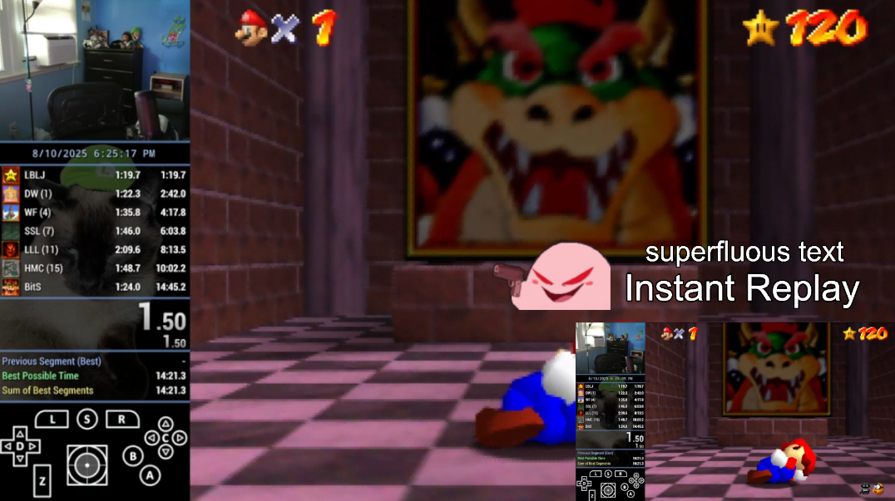

# OBS Instant Replay With Attached Sources (Tested on Windows)

This is an edit of the [instant replay OBS plugin](https://obsproject.com/forum/resources/instant-replay-vlc.621) that allows you to customize the playback by attaching any number of sources to the Media Source; they will all appear when the hotkey is pressed and be hidden when the replay ends.

I made this after [Weegee](https://www.twitch.tv/weegee) wanted to attach the text "Instant Replay" to the playback, but was limited by the aforementioned plugin. Just a fun little project, as it was my first time using the OBS API.

## Setup

1. Download the Lua script (instant-replay-weegee.lua)

2. Open OBS, navigate to Tools -> Scripts. Press the [ + ] button in the bottom left of the Scripts window, open the script (instant-replay-weegee.lua)

3. Navigate to Settings -> Output, find the Replay Buffer option and check the box to turn it on.

4. Navigate to Settings -> Hotkeys, find Instant Replay by typing it in the Filter search box. Set your preferred hotkey to start instant replays.

5. Navigate to the scene you want to stream or record. Add a new Media Source and give it whatever name you want. This will be the source that plays the actual video.

6. Add any other sources that you may want to appear with the instant replay.

7. Navigate back to Tools -> Scripts, add the Media Source you added in step 5.

8. Press the [ + ] button on the "Attached sources" property and type in the names of the sources you added in step 6 (or sources you already had before) one by one. Do not add the Media Source to the "Attached sources."

- Note: "Interval (ms)" and "Max attempts" can be left as is. For the defaults, when you press the hotkey, the script will try to fetch the replay file once every second for 10 seconds.

## Usage

1. Press the "Start Replay Buffer" button in the Controls panel (near Start Recording).

2. Press the hotkey you chose in step 4 of the setup when you want to see an instant replay.